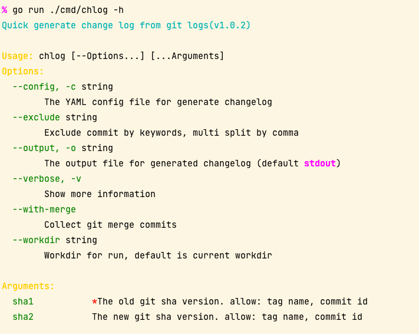

# GitWrap

Git command wrapper, git changelog, repo information and some git tools.

> Github https://github.com/gookit/gitw

## Install

> required: go 1.14+, git 2.x

```bash
go get github.com/gookit/gitw
```

## Usage

```go
package main

import (
	"fmt"

	"github.com/gookit/gitw"
)

func main() {
	// logTxt, err := gitw.Log("v1.0.2", "v1.0.3")
	logTxt := gitw.MustString(gitw.Log("v1.0.2", "v1.0.3"))
	fmt.Println(logTxt)

	// Local Branches
	brList := gitw.MustStrings(gitw.Branches())
	fmt.Println(brList)

	// custom create command

	logCmd := gitw.New("log", "-2")
	// git.Run()
	// txt, err := logCmd.Output()
	txt := logCmd.SafeOutput()

	fmt.Println(txt)
}
```

## Repository

You can quickly get a git repository information at local.

```go
repo := gitw.NewRepo("/path/to/my-repo")
```

**Remote Information**:

```go
rt := repo.DefaultRemoteInfo()

dump.Println(rt)
```

Output:


**Repo Information**:

```go
dump.Println(repo.Info())
```

Output:


## Changelog

You can quickly generate changelog by `gitw/chlog` package.

### Install

```shell
go install github.com/gookit/gitw/cmd/chlog@latest
```

### Usage

Please run `chlog -h` to see help:



**Example Run**:

```shell
chlog last head
chlog -config .github/changelog.md last head
```

**Outputs**:

```text
## Change Log

### Update

- update: update some logic for git command run [96147fb](https://github.com/gookit/gitw/commit/96147fba43caf462a50bc97d7ed078dd0059e797)
- update: move RepoUrl config to MarkdownFormatter [8c861bf](https://github.com/gookit/gitw/commit/8c861bf05ae3576aba401692124df63372ae9ed7)

### Fixed

- fix: gen changelog error [1636761](https://github.com/gookit/gitw/commit/16367617bc364ce1022097e89313c7b09983981a)

### Other

- style: update some code logic [4a9f146](https://github.com/gookit/gitw/commit/4a9f14656b26a08b0cdd9c4f9cec9ae3bf5938b1)
- build(deps): bump github.com/gookit/color from 1.4.2 to 1.5.0 [037fa47](https://github.com/gookit/gitw/commit/037fa477954b630fe34ff7ceab51e6132db645cb)
- style: update examples and readme [8277389](https://github.com/gookit/gitw/commit/8277389817917e6b0cb97f3e5629f2c5034075e4)

```

### Use on action

Can use `gitw/chlog` on github actions, like:

> Full script please see [.github/workflows/release.yml](.github/workflows/release.yml)

```yaml
# ...

    steps:
      - name: Checkout
        uses: actions/checkout@v3
        with:
          fetch-depth: 0

      - name: Setup Go Faster
        uses: WillAbides/setup-go-faster@v1.7.0
        timeout-minutes: 3
        with:
          go-version: 1.17 # or use ${{ matrix.go_version }} 

      - name: Generate changelog
        run: |
          go install github.com/gookit/gitw/cmd/chlog@latest
          chlog -config .github/changelog.yml -output testdata/changelog.md prev last 

```

### Use in code

```go
package main

import (
	"fmt"

	"github.com/gookit/gitw/chlog"
	"github.com/gookit/goutil"
)

func main() {
	cl := chlog.New()
	cl.Formatter = &chlog.MarkdownFormatter{
		RepoURL: "https://github.com/gookit/gitw",
	}
	cl.WithConfig(func(c *chlog.Config) {
		// some settings ...
		c.Title = "## Change Log"
	})

	// fetch git log
	cl.FetchGitLog("v0.1.0", "HEAD", "--no-merges")

	// do generate
	goutil.PanicIfErr(cl.Generate())

	// dump
	fmt.Println(cl.Changelog())
}
```

## Commands

### Commonly functions

Git command functions of std:

```go
func Alias(name string) string
func CommentChar(text string) (string, error)
func Config(name string) string
func ConfigAll(name string) ([]string, error)
func Dir() (string, error)
func Editor() string
func GlobalConfig(name string) (string, error)
func HasFile(segments ...string) bool
func Head() (string, error)
func Branches() ([]string, error)
func Log(sha1, sha2 string) (string, error)
func Tag(args ...string) (string, error)
func Quiet(args ...string) bool
func Ref(ref string) (string, error)
func RefList(a, b string) ([]string, error)
func Remotes() ([]string, error)
func Run(args ...string) error
func SetGlobalConfig(name, value string) error
func Show(sha string) (string, error)
func Spawn(args ...string) error
func SymbolicFullName(name string) (string, error)
func SymbolicRef(ref string) (string, error)
func Var(name string) string
func Version() (string, error)
func WorkdirName() (string, error)
```

Util functions:

```go
func SetDebug()
func ParseURL(rawURL string) (u *url.URL, err error)
func IsGitCommand(command string) bool
func IsGitDir(dir string) bool
func MustString(s string, err error) string
func MustStrings(ss []string, err error) []string
func EditText(data string) string
```

## Refer

- https://github/phppkg/phpgit
- https://github.com/github/hub
- https://github.com/alibaba/git-repo-go
