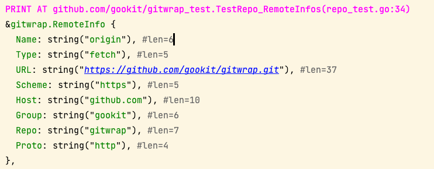
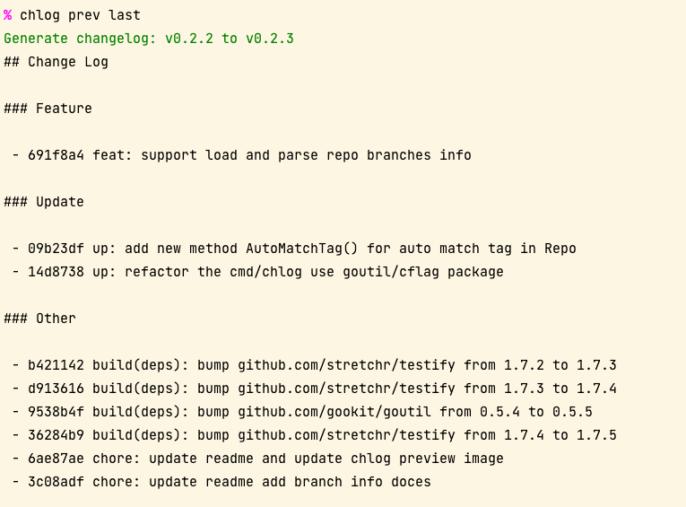

# Gitw


[](https://github.com/gookit/gitw)
[](https://pkg.go.dev/github.com/gookit/goutil)
[](https://goreportcard.com/report/github.com/gookit/gitw)
[](https://github.com/gookit/gitw/actions)
[](https://coveralls.io/github/gookit/gitw?branch=main)

`gitw` - 包装Git命令方便使用。生成变更记录日志，获取 repo,branch,remote 信息和一些 Git 命令工具。

> Github https://github.com/gookit/gitw

- 包装本地 `git` 命令以方便使用
- 快速运行 `git` 子命令,获取信息等
- 快速查询存储库信息
  - 获取 status, remote, branch 等详细信息
- 通过 `git log` 快速生成版本变更日志
  - 允许自定义生成配置
  - 允许自定义生成过滤、样式等
  - 可以直接在 GitHub Actions 中使用
- 支持 `git-emoji` code 搜索和替换渲染

> **[EN-README](README.md)**

## 安装

> 需要: go 1.18+, git 2.x

```bash
go get github.com/gookit/gitw
```

## 使用

```go
package main

import (
	"fmt"

	"github.com/gookit/gitw"
)

func main() {
	// logTxt, err := gitw.ShowLogs("v1.0.2", "v1.0.3")
	logTxt := gitw.MustString(gitw.ShowLogs("v1.0.2", "v1.0.3"))
	fmt.Println(logTxt)

	// Local Branches
	brList := gitw.MustStrings(gitw.Branches())
	fmt.Println(brList)

	// custom create command

	logCmd := gitw.New("log", "-2")
	// git.Run()
	// txt, err := logCmd.Output()
	txt := logCmd.SafeOutput()

	fmt.Println(txt)
}
```

### 使用更多参数

示例，通过 `git log` 获取两个 sha 版本之间的提交日志

```go
	logCmd := gitw.Log("--reverse").
		Argf("--pretty=format:\"%s\"", c.cfg.LogFormat)

	if c.cfg.Verbose {
		logCmd.OnBeforeExec(gitw.PrintCmdline)
	}

	// add custom args. eg: "--no-merges"
	logCmd.AddArgs("--no-merges")

	// logCmd.Argf("%s...%s", "v0.1.0", "HEAD")
	if sha1 != "" && sha2 != "" {
		logCmd.Argf("%s...%s", sha1, sha2)
	}

	fmt.Println(logCmd.SafeOutput())
```

## 仓库信息

可以通过 `gitw` 在本地快速获取 git 存储库信息。

```go
repo := gitw.NewRepo("/path/to/my-repo")
```

### Status 信息

```go
si := repo.StatusInfo()

dump.Println(si)
```

**Output**:


### Branch 信息

```go
brInfo := repo.CurBranchInfo()

dump.Println(brInfo)
```

**Output**:


### Remote 信息

```go
rt := repo.DefaultRemoteInfo()

dump.Println(rt)
```

**Output**:



**仓库信息**:

```go
dump.Println(repo.Info())
```

**Output**:


## 生成变更日志

可以通过 `gitw/chlog` 包快速生成变更日志。

- 允许自定义生成配置 请看 [.github/changelog.yml](.github/changelog.yml)
- 可以设置过滤、分组、输出样式等

### 安装

```shell
go install github.com/gookit/gitw/cmd/chlog@latest
```

### 使用

运行 `chlog -h` 查看帮助:


**生成变更日志:**:

```shell
chlog prev last
chlog last head
chlog -c .github/changelog.yml last head
```

**Outputs**:



### 在GitHub Action使用

`gitw/chlog` 可以直接在 `GitHub Actions` 中使用。不依赖 Go 环境，下载对应系统的二进制文件即可。

示例:

> Full script please see [.github/workflows/release.yml](.github/workflows/release.yml)

```yaml
# ...

    steps:
      - name: Checkout
        uses: actions/checkout@v3
        with:
          fetch-depth: 0

      - name: Generate changelog
        run: |
          curl https://github.com/gookit/gitw/releases/latest/download/chlog-linux-amd64 -L -o /usr/local/bin/chlog
          chmod a+x /usr/local/bin/chlog
          chlog -c .github/changelog.yml -o changelog.md prev last 

```

### 在项目中使用

在项目代码中使用

```go
package main

import (
	"fmt"

	"github.com/gookit/gitw/chlog"
	"github.com/gookit/goutil"
)

func main() {
	cl := chlog.New()
	cl.Formatter = &chlog.MarkdownFormatter{
		RepoURL: "https://github.com/gookit/gitw",
	}
	cl.WithConfig(func(c *chlog.Config) {
		// some settings ...
		c.Title = "## Change Log"
	})

	// fetch git log
	cl.FetchGitLog("v0.1.0", "HEAD", "--no-merges")

	// do generate
	goutil.PanicIfErr(cl.Generate())

	// dump
	fmt.Println(cl.Changelog())
}
```

## Commands

### Methods in `GitWrap`

Commands of git, more please see [pkg.go.dev](https://pkg.go.dev/github.com/gookit/gitw#GitWrap)

```go
func (gw *GitWrap) Add(args ...string) *GitWrap
func (gw *GitWrap) Annotate(args ...string) *GitWrap
func (gw *GitWrap) Apply(args ...string) *GitWrap
func (gw *GitWrap) Bisect(args ...string) *GitWrap
func (gw *GitWrap) Blame(args ...string) *GitWrap
func (gw *GitWrap) Branch(args ...string) *GitWrap
func (gw *GitWrap) Checkout(args ...string) *GitWrap
func (gw *GitWrap) CherryPick(args ...string) *GitWrap
func (gw *GitWrap) Clean(args ...string) *GitWrap
func (gw *GitWrap) Clone(args ...string) *GitWrap
func (gw *GitWrap) Commit(args ...string) *GitWrap
func (gw *GitWrap) Config(args ...string) *GitWrap
func (gw *GitWrap) Describe(args ...string) *GitWrap
func (gw *GitWrap) Diff(args ...string) *GitWrap
func (gw *GitWrap) Fetch(args ...string) *GitWrap
func (gw *GitWrap) Init(args ...string) *GitWrap
func (gw *GitWrap) Log(args ...string) *GitWrap
func (gw *GitWrap) Merge(args ...string) *GitWrap
func (gw *GitWrap) Pull(args ...string) *GitWrap
func (gw *GitWrap) Push(args ...string) *GitWrap
func (gw *GitWrap) Rebase(args ...string) *GitWrap
func (gw *GitWrap) Reflog(args ...string) *GitWrap
func (gw *GitWrap) Remote(args ...string) *GitWrap
// and more ...
```

### Commonly functions

Git command functions of std:

```go
func Alias(name string) string
func AllVars() string
func Branches() ([]string, error)
func CommentChar(text string) (string, error)
func Config(name string) string
func ConfigAll(name string) ([]string, error)
func DataDir() (string, error)
func EditText(data string) string
func Editor() string
func GlobalConfig(name string) (string, error)
func HasDotGitDir(path string) bool
func HasFile(segments ...string) bool
func Head() (string, error)
func Quiet(args ...string) bool
func Ref(ref string) (string, error)
func RefList(a, b string) ([]string, error)
func Remotes() ([]string, error)
func SetGlobalConfig(name, value string) error
func SetWorkdir(dir string)
func ShowDiff(sha string) (string, error)
func ShowLogs(sha1, sha2 string) (string, error)
func Spawn(args ...string) error
func SymbolicFullName(name string) (string, error)
func SymbolicRef(ref string) (string, error)
func Tags(args ...string) ([]string, error)
func Var(name string) string
func Version() (string, error)
func Workdir() (string, error)
func WorkdirName() (string, error)
```

### Util functions

```go
func SetDebug()
func SetDebug(open bool)
func IsDebug() bool
func IsGitCmd(command string) bool
func IsGitCommand(command string) bool
func IsGitDir(dir string) bool
func ParseRemoteURL(URL string, r *RemoteInfo) (err error)
func MustString(s string, err error) string
func MustStrings(ss []string, err error) []string
func FirstLine(output string) string
func OutputLines(output string) []string
func EditText(data string) string
```

### Remote info

```go
// type RemoteInfo
func NewEmptyRemoteInfo(URL string) *RemoteInfo
func NewRemoteInfo(name, url, typ string) (*RemoteInfo, error)
func (r *RemoteInfo) GitURL() string
func (r *RemoteInfo) Invalid() bool
func (r *RemoteInfo) Path() string
func (r *RemoteInfo) RawURLOfHTTP() string
func (r *RemoteInfo) RepoPath() string
func (r *RemoteInfo) String() string
func (r *RemoteInfo) URLOfHTTP() string
func (r *RemoteInfo) URLOfHTTPS() string
func (r *RemoteInfo) Valid() bool
```

## Refer

- https://github/phppkg/phpgit
- https://github.com/github/hub
- https://github.com/alibaba/git-repo-go

## LICENSE

[MIT](LICENSE)
